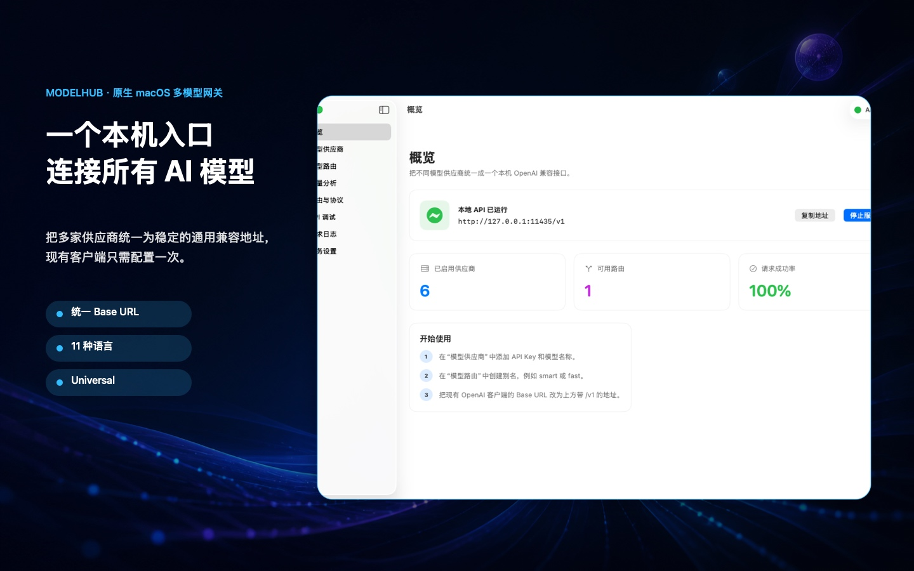

# ModelHub

[](https://github.com/dw-zhu-si/ModelHub/releases) [](LICENSE) [](https://www.apple.com/macos/)

English · [简体中文](README.md)

## Product overview

ModelHub is a native macOS local gateway for multi-provider AI APIs. It gives your clients one widely compatible Base URL and stable model aliases, while ModelHub handles provider credentials, protocol differences, health checks, quarantine, routing, failover, budgets, usage analytics, and native media capabilities on the same Mac.

The product is designed for developers, local agents, and power users who are tired of changing every client when a provider, model name, API key, or endpoint changes. A model that failed yesterday should not silently receive traffic today, and an untested model should not be exposed as if it were ready. ModelHub makes those states explicit and keeps normal catalog reads local and side-effect free.

Typical users include:

- developers using the compatible SDK, Cursor, Continue, Cline, or custom agents;
- individuals and small teams combining several model providers;
- applications that need failover, weighted traffic, capability filtering, cost controls, or latency-aware routing;
- users who want credentials, logs, and model availability to remain on their Mac instead of in another hosted gateway.



### The mental model

```text
Your client or agent
        │  one Base URL + one stable alias
        ▼
ModelHub local gateway (127.0.0.1:11435)
        │  health, quarantine, capability, cost, latency, resilience
        ├── widely compatible providers
        ├── Anthropic / Gemini protocol adapters
        ├── image, video, speech, embeddings, reranking
        └── restricted native provider actions
```

## Why ModelHub

### One local API for many protocols

Clients call `http://127.0.0.1:11435/v1`. ModelHub resolves aliases, chooses a target, injects the provider credential from Keychain, converts protocols when needed, and forwards the response. Adding or replacing a provider normally does not require changing every client.

### Only explicitly usable models are exposed

`/v1/models` and `/v1/models/available` return only models whose latest local health state is explicitly `available`, whose provider is enabled, and which are not quarantined. Unavailable, unknown, unconfigured, and empty routes stay out of the external catalog. Reading the catalog never calls a provider.

### Testing is separate from normal traffic

Normal external calls do not refresh provider catalogs or re-test models. A user must explicitly run a model, provider, or all-model test. Chat tests can make a real provider request; media and provider-specific action models are not incorrectly sent through the chat endpoint.

### Native macOS workflow

ModelHub uses a native menu-bar extra and never shows a Dock icon. A clean installation opens the main window once so users can configure the app or enter the credential-free review demo; later launches stay in the menu bar by default. It supports launch at login and a credential-free WidgetKit status widget. Background Keychain reads are non-interactive; macOS authorization is only requested when a user chooses to reveal, copy, or edit a credential.

## Features

### API and protocols

- Unified Protocol Chat Completions: `POST /v1/chat/completions`;
- Unified Protocol Responses: `POST /v1/responses`, including tools, multimodal fields, and incremental SSE;
- model, provider, health, and usage catalogs: `/v1/models`, `/v1/models/available`, `/v1/providers`, `/v1/analytics`;
- native image, video, task, speech, transcription, embedding, and reranking endpoints;
- restricted provider actions through `POST /v1/native`;
- read-only local MCP, A2A, and ACP stdio surfaces with a separate Agent token.
- MCP can read task context explicitly saved by the user and invoke text, image, video, speech, embedding, and reranking models; install it into Codex or Claude Desktop with one click, or copy a manual configuration.

See the complete [OpenAPI contract](openapi/modelhub-openapi.yaml).

### Routing and resilience

- priority failover, round-robin, and weighted random;
- lowest latency, highest stability, lowest cost, largest context, and balanced scoring;
- three non-removable, mutually exclusive same-model defaults: lowest cost, lowest latency, or official provider first;
- capability filters for tools, vision, audio, and other incompatible targets;
- per-minute rate limits, per-target concurrency caps, circuit breakers, cooldowns, exponential backoff, and bounded fallback;
- no unconditional replay of a request that may already have been billed;
- quarantined targets are removed from routes until a user explicitly clears or revalidates them.

### Health and quarantine

Every model health record includes its last check time, latency, HTTP status, and a readable reason. The UI distinguishes “available”, “pending verification · quarantined”, “unavailable”, and “needs configuration/processing”; an empty health record is never treated as usable.

| State | External catalog | Normal routing | Explicit test |
| --- | --- | --- | --- |
| Available | Included | Allowed | Can be revalidated |
| Pending verification · quarantined | Hidden | Blocked | Chat models can be probed again |
| Unavailable | Hidden | Blocked | Can be tested again |
| Needs configuration/processing | Hidden | Blocked | Configure the provider or native protocol first |

### Cost and usage controls

- aggregate requests, success rate, latency, tokens, estimated cost, and context savings by model and provider;
- manual pricing source and timestamp, monthly token quotas, budget warnings, and hard limits;
- unknown pricing stays unknown instead of becoming a made-up estimate;
- import preview, a 10 MiB configuration backup limit, and automatic rollback copies; Keychain secrets are never backed up.

### Providers and native protocols

| Category | Coverage |
| --- | --- |
| widely compatible | DeepSeek, Qwen, Kimi, GLM, Grok, Groq, Mistral, Ollama, and other compatible services |
| Native text adapters | Anthropic Claude and Google Gemini |
| Native media/task adapters | APIMart Seedance, Agnes image/video, Alibaba Cloud Bailian speech, and standard image/audio/embedding/rerank APIs |
| Restricted native actions | Configured providers such as Yunwu API for Midjourney, Suno, Kling, PixVerse, and similar provider-specific actions |

“Supported provider” means that the protocol and configuration entry exist. It does not mean that your account has access, balance, regional permission, or a successful live check.

### Credential-free review demo

On a clean installation with no configured providers, the Overview screen offers Review Demo Mode. It supplies synthetic providers, text/reasoning/image/music/video categories, routes, health, usage, and logs, and the API Console returns a clearly labeled local sample response. Demo mode never reads provider credentials, contacts an upstream service, incurs charges, or persists demo configuration; exiting restores the previous in-memory state.

## Security and privacy boundaries

- the service binds only to `127.0.0.1:11435` by default;
- gateway Bearer tokens and provider API keys are stored in macOS Keychain;
- logs do not contain keys, tokens, prompts, or model response bodies;
- Widget snapshots contain only status and aggregate counters;
- backups exclude Keychain and imports have preview and rollback protection;
- `/v1/native` is host-bound and rejects hostnames and `..` path traversal;
- MCP, A2A, and ACP use a separate Agent token and reject non-loopback Origins;
- ModelHub does not replace a provider's own access, billing, content, or retention policies.

## Install

Download the notarized [v1.9.0 build 23 release](https://github.com/dw-zhu-si/ModelHub/releases/tag/v1.9.0-build23), open `ModelHub-1.9.0-macos-universal.dmg`, and drag `ModelHub.app` to Applications. The DMG and the app are Developer ID signed and passed Apple notarization, ticket stapling, image integrity, and Gatekeeper checks. A Universal ZIP is also available in the same release.

### Requirements

- macOS 14.0 or later;
- Apple Silicon (arm64) or Intel (x86_64) Mac;
- your own provider accounts, API keys, balance, and regional permissions.

### Verify the release

```text
ebe85bc9872c92182cd6925faf52e3b64e60b885e6474144f659ad6896c8021b  ModelHub-1.9.0-macos-universal.zip
2f06fbcaeb91ed5300ff77128ee6b03e2d5faded4aa345ea695913874d0abf94  ModelHub-1.9.0-macos-universal.dmg
```

```bash
shasum -a 256 -c ModelHub-1.9.0-SHA256.txt
```

## Quick start

1. Add a provider, Base URL, API key, and model names in **Model Providers**.
2. If you need an online check, run a model, provider, or all-model test and confirm possible upstream charges.
3. Create a stable alias such as `smart` in **Model Routes**, add targets, and select a strategy.
4. Copy the local endpoint and gateway token from **Service Settings**.
5. Set your client's Base URL to `http://127.0.0.1:11435/v1` and use either the alias or an available model ID.

### Chat Completions

```bash
curl http://127.0.0.1:11435/v1/chat/completions \
  -H "Authorization: Bearer YOUR_MODELHUB_TOKEN" \
  -H "Content-Type: application/json" \
  -d '{
    "model": "smart",
    "messages": [{"role": "user", "content": "Introduce yourself in one sentence."}],
    "stream": false
  }'
```

### Responses

```bash
curl http://127.0.0.1:11435/v1/responses \
  -H "Authorization: Bearer YOUR_MODELHUB_TOKEN" \
  -H "Content-Type: application/json" \
  -d '{"model":"smart","input":"List three weekend coding exercises."}'
```

### Read the local available-model catalog

These requests read the local health snapshot only. They do not fetch provider catalogs, test models, or create upstream charges:

```bash
curl http://127.0.0.1:11435/v1/models \
  -H "Authorization: Bearer YOUR_MODELHUB_TOKEN"

# Compatibility alias
curl http://127.0.0.1:11435/v1/models/available \
  -H "Authorization: Bearer YOUR_MODELHUB_TOKEN"
```

## Build and test

Requirements: macOS 14+, Xcode 16+, and Swift 6.

```bash
git clone https://github.com/dw-zhu-si/ModelHub.git
cd ModelHub
swift test --scratch-path .build/tests
./scripts/package_app.sh release
open ./dist/ModelHub.app
```

Project layout:

```text
Sources/ModelHub/             SwiftUI app, menu bar, Keychain, and local HTTP server
Sources/ModelHubCore/         routing, protocol bridges, health, budget, resilience, usage
Sources/ModelHubWidget/       WidgetKit extension
Sources/ModelHubACP/          local ACP stdio entry point
Tests/                        core, HTTP, streaming, localization, and widget tests
openapi/                      request/response contract
packaging/                    bundle metadata, entitlements, and localization
scripts/                      build, notarization, release, and store-artwork tools
docs/                         security threat model and OmniRoute boundary
```

Local builds are ad-hoc signed by default. Developer ID notarization and Mac App Store signing require the corresponding Apple identities, certificates, and provisioning profiles. Never commit API keys, tokens, signing assets, profiles, local configuration, prompts, or real responses.

## Protocol boundaries and limitations

- widely compatible extra fields are preserved where possible and aliases are replaced with the selected upstream model name;
- Anthropic and Gemini support text, system content, tool definitions/results, image content, and SSE conversion; content that cannot be represented safely returns HTTP 400 instead of being silently dropped;
- image, video, speech, transcription, embedding, and reranking models must use their native endpoints;
- chat tests make real upstream requests and may cost money; media models are checked for local protocol support without automatically generating media;
- `/v1/native` is restricted passthrough, not a parameter guessing layer; follow the provider's current documentation;
- “available” means the latest local check succeeded, not that a provider guarantees balance, SLA, or continuous uptime;
- ModelHub does not execute model-produced tool calls and does not provide public tunneling, remote credential hosting, or system MITM proxying.

## FAQ

### Why is a model missing from `/v1/models`?

Check its health state in ModelHub. Only enabled, explicitly available, non-quarantined models are exposed. An untested model is not treated as available. Run an explicit test to revalidate a quarantined chat model.

### Why does an external call not refresh the provider catalog?

The catalog is intentionally a local read-only snapshot. This avoids repeated provider traffic, accidental charges, and turning a temporary outage into a storm of retries. Use an explicit test in the app when you want a refresh.

### What Base URL should clients use?

Use `http://127.0.0.1:11435/v1`, not a provider URL. Keep `/v1` when the client appends `/chat/completions`, and send the gateway token as `Authorization: Bearer ...`.

## Open source and support

ModelHub is licensed under [Apache License 2.0](LICENSE). Its routing, resilience, budget, context, protocol, and local-agent feature set was informed by the MIT-licensed [OmniRoute](https://github.com/diegosouzapw/OmniRoute) project and implemented with native Swift/macOS capabilities; see [THIRD_PARTY_NOTICES.md](THIRD_PARTY_NOTICES.md).

- Contributions: [CONTRIBUTING.md](CONTRIBUTING.md)
- Security reports: [SECURITY.md](SECURITY.md) — never post credentials in a public issue
- API contract: [openapi/modelhub-openapi.yaml](openapi/modelhub-openapi.yaml)
- Product page: [pm.jcm99.com/apple/modelhub](https://pm.jcm99.com/apple/modelhub/)
- Support: [pm.jcm99.com/apple/modelhub/support.html](https://pm.jcm99.com/apple/modelhub/support.html)
- Privacy policy: [pm.jcm99.com/apple/modelhub/privacy.html](https://pm.jcm99.com/apple/modelhub/privacy.html)

Issues, documentation improvements, and protocol adapters are welcome. Please read [CONTRIBUTING.md](CONTRIBUTING.md) and ensure no credentials or user data are included in a contribution.
